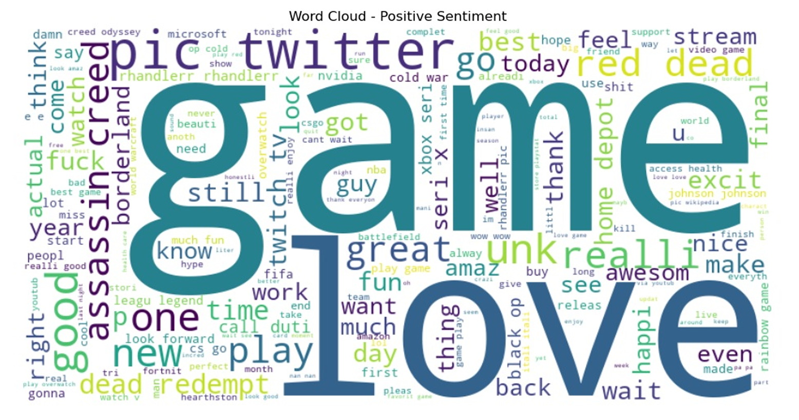

# 🐦 Twitter Sentiment Analysis – Sentiment Classification on Twitter Data

This project performs **Sentiment Analysis** on Twitter data to classify tweets into sentiment categories (Positive, Negative, Neutral). The aim is to understand public opinion on various entities and topics by analyzing tweet content.

## 🔍 Project Highlights

- Cleaned and preprocessed raw Twitter text data  
- Applied text normalization including stopword removal and stemming  
- Visualized sentiment distribution and generated word clouds  
- Vectorized text data using TF-IDF  
- Built and evaluated a **Naive Bayes classifier** for sentiment prediction  
- Provided detailed model evaluation: **accuracy**, **confusion matrix**, and **classification report** 

## 📊 Key Features

- Multi-class sentiment classification (Positive / Negative / Neutral)  
- Text preprocessing for natural language data  
- Exploratory data analysis through visualizations  
- Model performance analysis and insights  

## 📈 Visuals

### positive wordcloud

### Sentimental distribution

## 🧰 Tools Used

- Python  
- Pandas  
- NLTK (Natural Language Toolkit)  
- Scikit-learn  
- Matplotlib & Seaborn  
- WordCloud  

## 📁 Files Included

- `twitter_training.csv` – Raw Twitter dataset  
- `sentiment_analysis.ipynb` – Jupyter notebook with step-by-step implementation  
- `positive_wordcloud.png` – Word cloud visualization for positive sentiment tweets  
- `sentiment_distribution.png` – Sentiment distribution bar chart  
- `README.md` – Project documentation  

## 📂 Dataset Source

**Kaggle – Twitter Entity Sentiment Analysis**  
🔗 https://www.kaggle.com/datasets/jp797498e/twitter-entity-sentiment-analysis

---

## 📌 Summary

This project was completed as **Task 04** during my **Data Analyst Internship at Prodigy InfoTech**.  
It provided practical experience with:

- **Natural Language Processing (NLP)**  
- **Text preprocessing and feature extraction**  
- **Machine learning classification models**  
- **Data visualization for text analytics**  

## 👩‍💻 Author
**Harshitha Adicherla**

📬 Feedback and suggestions are welcome!

